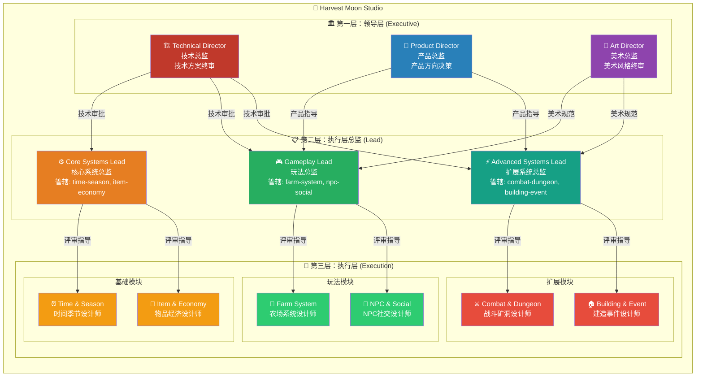
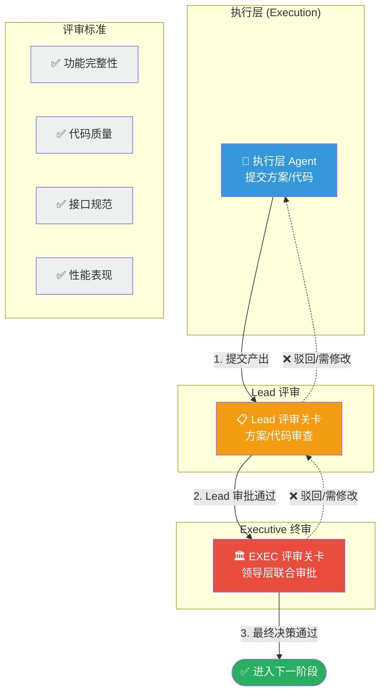
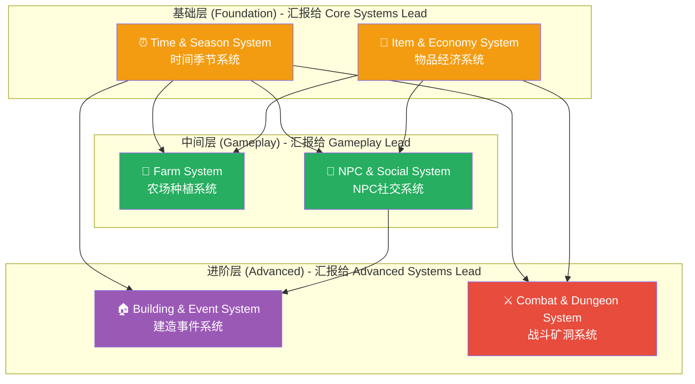
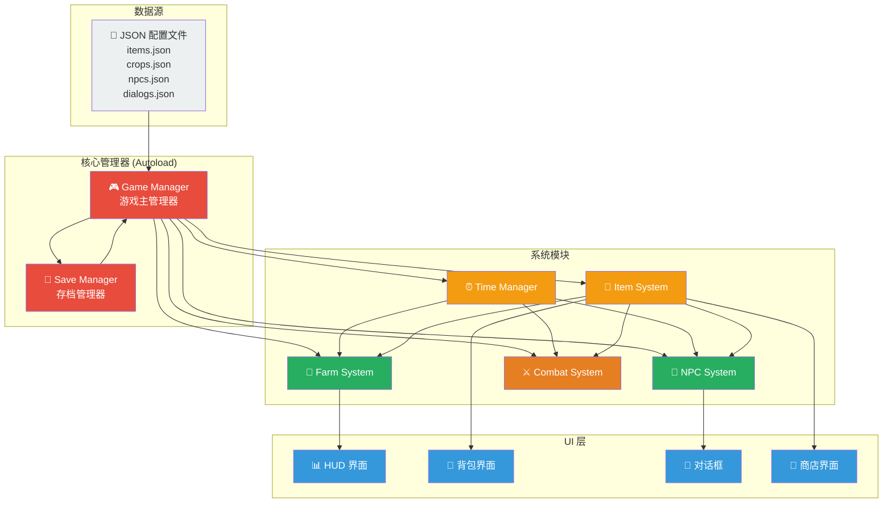
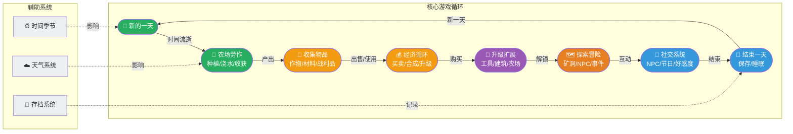

# 🌾 Harvest Moon Studio 架构图表

## 1. 三层组织架构图（新版）



## 2. 三级评审流程图（新增）



## 3. 模块依赖关系图



## 4. Agent 协作流程图（含评审关卡）

```mermaid
flowchart LR
    subgraph "Phase 1: 设计阶段"
        direction TB
        PD["🎯 Product Director<br/>输出GDD文档"]
        AD["🎨 Art Director<br/>输出美术指南"]
        TD["🏗️ Technical Director<br/>输出技术架构"]
        EXEC1["🏛️ EXEC 评审"]
    end
    
    subgraph "Phase 2: 方案设计"
        direction TB
        CSL["⚙️ Core Systems Lead<br/>审核基础模块方案"]
        LR1["📋 LEAD 评审"]
        GL["🎮 Gameplay Lead<br/>审核玩法模块方案"]
        LR2["📋 LEAD 评审"]
        ASL["⚡ Advanced Systems Lead<br/>审核扩展模块方案"]
        LR3["📋 LEAD 评审"]
    end
    
    subgraph "Phase 3: 编码实现"
        direction TB
        TM["⏰ Time & Season"]
        IE["🎒 Item & Economy"]
        FS["🌱 Farm System"]
        NS["👥 NPC & Social"]
        CD["⚔️ Combat & Dungeon"]
        BE["🏠 Building & Event"]
    end
    
    subgraph "Phase 4: 集成打磨"
        direction TB
        CSL2["⚙️ 基础模块集成"]
        GL2["🎮 玩法模块集成"]
        ASL2["⚡ 扩展模块集成"]
        TD2["🏗️ 最终集成审查"]
        EXEC2["🏛️ EXEC 验收"]
    end
    
    PD --> AD
    AD --> TD
    TD --> EXEC1
    EXEC1 --> CSL
    CSL --> LR1
    LR1 --> GL
    GL --> LR2
    LR2 --> ASL
    ASL --> LR3
    
    LR3 --> TM & IE
    TM & IE --> FS & NS
    FS & NS --> CD & BE
    
    TM & IE --> CSL2
    FS & NS --> GL2
    CD & BE --> ASL2
    
    CSL2 & GL2 & ASL2 --> TD2
    TD2 --> EXEC2
    
    style PD fill:#2980b9,color:#fff
    style AD fill:#8e44ad,color:#fff
    style TD fill:#c0392b,color:#fff
    style EXEC1 fill:#c0392b,color:#fff
    style CSL fill:#e67e22,color:#fff
    style GL fill:#27ae60,color:#fff
    style ASL fill:#16a085,color:#fff
    style LR1 fill:#f39c12,color:#fff
    style LR2 fill:#f39c12,color:#fff
    style LR3 fill:#f39c12,color:#fff
    style TM fill:#f39c12,color:#fff
    style IE fill:#f39c12,color:#fff
    style FS fill:#2ecc71,color:#fff
    style NS fill:#2ecc71,color:#fff
    style CD fill:#e74c3c,color:#fff
    style BE fill:#e74c3c,color:#fff
    style TD2 fill:#c0392b,color:#fff
    style EXEC2 fill:#c0392b,color:#fff
```



## 5. 数据流向图



## 6. 角色能力矩阵图

```mermaid
graph radar
    subgraph "领导层能力"
        direction LR
        TD["🏗️ 技术总监<br/>技术架构: ★★★★★<br/>代码质量: ★★★★★<br/>系统集成: ★★★★★<br/>游戏设计: ★★☆☆☆"]
        PD["🎯 产品总监<br/>产品方向: ★★★★★<br/>数值平衡: ★★★★★<br/>内容规划: ★★★★★<br/>技术实现: ★★☆☆☆"]
        AD["🎨 美术总监<br/>美术风格: ★★★★★<br/>视觉规范: ★★★★★<br/>资源规划: ★★★★★<br/>代码实现: ★☆☆☆☆"]
    end
    
    subgraph "Lead 层能力"
        direction LR
        CSL["⚙️ 核心系统总监<br/>系统评审: ★★★★★<br/>代码收口: ★★★★★<br/>基础架构: ★★★★★<br/>玩法设计: ★★☆☆☆"]
        GL["🎮 玩法总监<br/>玩法评审: ★★★★★<br/>体验把控: ★★★★★<br/>内容深度: ★★★★★<br/>代码实现: ★★★☆☆"]
        ASL["⚡ 扩展系统总监<br/>扩展评审: ★★★★★<br/>系统融合: ★★★★★<br/>进阶深度: ★★★★★<br/>代码实现: ★★★☆☆"]
    end
    
    subgraph "执行层能力"
        direction LR
        TM["⏰ Time & Season<br/>系统设计: ★★★★☆<br/>GDScript: ★★★★☆<br/>文档: ★★★★☆"]
        IE["🎒 Item & Economy<br/>系统设计: ★★★★☆<br/>GDScript: ★★★★☆<br/>数据结构: ★★★★★"]
        FS["🌱 Farm System<br/>游戏逻辑: ★★★★★<br/>GDScript: ★★★★☆<br/>数据驱动: ★★★★☆"]
        NS["👥 NPC & Social<br/>对话系统: ★★★★★<br/>行为AI: ★★★★☆<br/>情感设计: ★★★★★"]
        CD["⚔️ Combat & Dungeon<br/>战斗系统: ★★★★★<br/>AI行为树: ★★★★★<br/>地图生成: ★★★★☆"]
        BE["🏠 Building & Event<br/>事件系统: ★★★★★<br/>触发逻辑: ★★★★☆<br/>内容创作: ★★★★★"]
    end

    style TD fill:#c0392b,color:#fff
    style PD fill:#2980b9,color:#fff
    style AD fill:#8e44ad,color:#fff
    style CSL fill:#e67e22,color:#fff
    style GL fill:#27ae60,color:#fff
    style ASL fill:#16a085,color:#fff
    style TM fill:#f39c12,color:#fff
    style IE fill:#f39c12,color:#fff
    style FS fill:#2ecc71,color:#fff
    style NS fill:#2ecc71,color:#fff
    style CD fill:#e74c3c,color:#fff
    style BE fill:#e74c3c,color:#fff
```

## 7. 游戏核心循环图



## 使用说明

1. 在支持 Mermaid 的 Markdown 查看器中打开此文件（如 GitHub、VS Code + Mermaid 插件）
2. 查看 **图1** 理解三层组织架构
3. 查看 **图2** 理解三级评审流程
4. 查看 **图3** 理解模块依赖关系
5. 查看 **图4** 理解完整的协作流程（含评审关卡）
6. 参考其他图表作为开发参考
